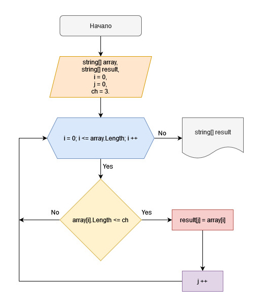

## Задача:
Написать программу, которая из имеющегося массива строк формирует массив из строк, длина которых меньше либо равна 3 символа. Первоначальный массив можно ввести с клавиатуры, либо задать на старте выполнения алгоритма. При решении не рекомендуется пользоваться коллекциями, лучше обойтись исключительно массивами.
##### _PS: Не плохо было-бы избавиться от "магического числа" "3"._

## Блок-схема алгоритма:

### Алгоритм решения:
1. Вводим с клавиатуры исходный массив из строк
2. Избавляемся от магического числа 3, вводя целочисленную переменную ch (*от англ. "character"*)
3. Определяем длинну результирующего массива, пересчитав количество элементов длинной <= ch (в нашем случае 3)
4. Перебираем элементы из исходного массива в поисках значений удовлетворяющих условию задачи: "длина которых меньше либо равна 3 символам"
5. Если строка удовлетворяет условию кладем элемент в результирующий массив
6. Повторяем цикл (пункты "4" и "5") до тех пор пока не достигнем конца исходного массива
7. Возвращаем результирующий заполненый массив
